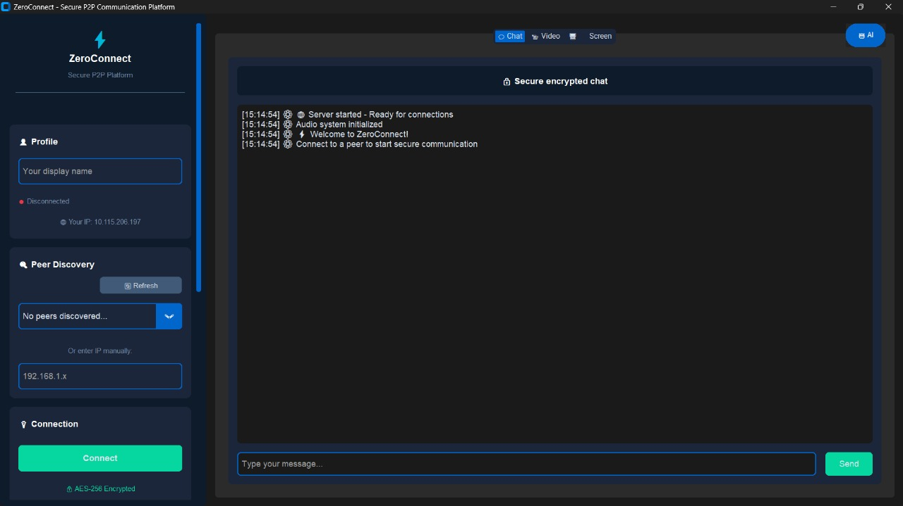
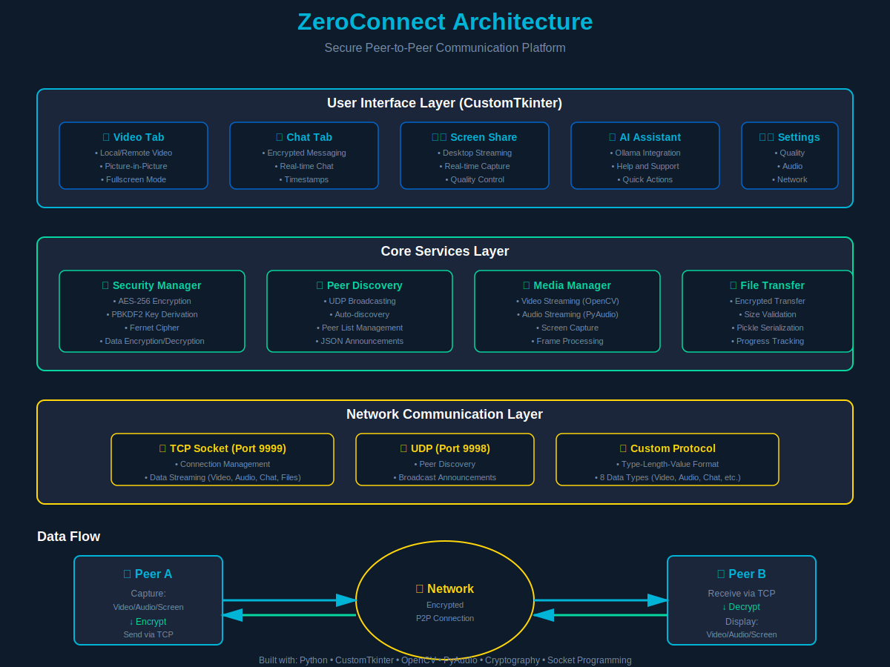

# ⚡ ZeroConnect

> **Secure Peer-to-Peer Communication Platform with End-to-End Encryption**

<p align="center">
  
</p>

<p align="center">
  
  
  
  
  
</p>

---

## 🎯 About

ZeroConnect is a modern, feature-rich P2P communication application that enables secure video calls, screen sharing, voice chat, and file transfers without relying on central servers. Built with Python and featuring a sleek dark-themed UI, it provides end-to-end encrypted communication for privacy-conscious users.

### Why ZeroConnect?

<table>
  <tr>
    <td width="33%" align="center">
      <h3>🔐 Secure</h3>
      <p>AES-256 encryption<br/>End-to-end security<br/>No data on servers</p>
    </td>
    <td width="33%" align="center">
      <h3>⚡ Fast</h3>
      <p>Direct P2P connection<br/>No server lag<br/>Real-time streaming</p>
    </td>
    <td width="33%" align="center">
      <h3>🎨 Modern</h3>
      <p>Beautiful dark UI<br/>Responsive design<br/>Intuitive controls</p>
    </td>
  </tr>
</table>

---

## ✨ Features

### 🔐 Security First
- **AES-256 Encryption** for all communications
- **PBKDF2 Key Derivation** with 100,000 iterations
- End-to-end encrypted messaging, file transfers, and media streams
- Zero data stored on external servers
- No third-party dependencies for communication

### 📹 Video & Audio
- HD video calling with quality controls (480p/720p/1080p)
- Real-time audio streaming with PyAudio
- Picture-in-Picture mode for multitasking
- Fullscreen video support (double-click to toggle)
- Resizable video panels with draggable separator
- Local and remote video display simultaneously

### 🖥️ Screen Sharing
- Share your entire screen in real-time
- Optimized compression for smooth streaming
- Perfect for presentations and remote support
- Easy toggle on/off

### 💬 Real-Time Chat
- Encrypted instant messaging
- Timestamp tracking for all messages
- Clean, modern chat interface
- Message history during session
- Color-coded messages (you vs peer)

### 📁 Secure File Transfer
- Send files up to 100MB
- Encrypted file transmission
- Progress tracking and notifications
- Support for all file types

### 🔍 Auto Peer Discovery
- Automatic detection of peers on local network
- UDP broadcasting for zero-configuration setup
- Manual IP entry option
- Real-time peer list updates
- Shows peer name and IP address

### 🤖 AI Assistant (Optional)
- Integrated AI help using Ollama
- Feature explanations and troubleshooting
- Quick action commands
- Context-aware assistance

### 🎨 Modern UI
- Dark-themed, responsive design
- Customizable settings panel
- Smooth animations and transitions
- Adaptive layouts for different screen sizes
- Tab-based interface for easy navigation
- Professional color scheme

---

## 🛠️ Technology Stack

- **GUI Framework:** CustomTkinter (modern tkinter)
- **Video Processing:** OpenCV (cv2)
- **Audio:** PyAudio
- **Encryption:** Cryptography (Fernet/AES-256)
- **Networking:** Socket programming (TCP/UDP)
- **Screen Capture:** PyAutoGUI
- **Image Processing:** Pillow (PIL)
- **AI Integration:** Ollama (optional)

---

## 📋 Requirements

### Python Dependencies
```bash
pip install customtkinter opencv-python pyaudio pyautogui Pillow cryptography numpy
```

### System Requirements
- **Python:** 3.8 or higher
- **OS:** Windows, Linux, or MacOS
- **Webcam:** For video calls
- **Microphone:** For audio communication
- **Network:** Local network connection (LAN) for P2P
- **Ports:** 9999 (TCP) and 9998 (UDP) must be available

### Optional
- **Ollama** with gemma3:270m model (for AI assistant feature)

---

## 🚀 Quick Start

1. **Clone the repository**
```bash
git clone https://github.com/yourusername/zeroconnect.git
cd zeroconnect
```

2. **Install dependencies**
```bash
pip install -r requirements.txt
```

3. **Run the application**
```bash
python zeroconnect.py
```

4. **Connect to a peer**
   - Launch ZeroConnect on both devices (same network)
   - Wait for auto-discovery (peers appear in dropdown)
   - Select a peer or enter IP manually
   - Click "Connect" button
   - Start video, audio, or screen sharing!

---

## 📖 Usage Guide

### Connecting to a Peer

**Method 1: Auto-Discovery (Recommended)**
1. Launch ZeroConnect on both devices
2. Wait 2-3 seconds for peer discovery
3. Select peer from dropdown menu
4. Click "Connect"

**Method 2: Manual Connection**
1. Enter peer's IP address in the input field
2. Click "Connect"

### Starting Media

- **Video Call:** Click "📹 Video" button
- **Audio:** Click "🎤 Audio" button
- **Screen Share:** Click "🖥️ Screen Share" button
- **Picture-in-Picture:** Click "📱 Picture-in-Picture" for floating window

### Video Controls

- **Fullscreen:** Double-click any video panel
- **Resize Panels:** Drag the blue separator between local/remote video
- **Exit Fullscreen:** Double-click again

### Sending Files

1. Click "📤 Send File" button
2. Select file from your computer (max 100MB)
3. File is automatically encrypted and sent
4. Peer receives notification and can save file

### Chat

1. Type message in chat input field
2. Press Enter or click "Send"
3. All messages are end-to-end encrypted

### Settings

Click "⚙️ All Settings" to configure:
- **Video Quality:** Low (50), Medium (70), High (90)
- **Resolution:** 480p, 720p, 1080p
- **Audio Sample Rate:** 22050, 44100, 48000 Hz
- **Encryption Password:** Custom encryption key
- **Network Port:** Default 9999

---

## 🏗️ Architecture

<p align="center">
  
</p>

The application follows a layered architecture:

### Layers

1. **UI Layer** - CustomTkinter-based responsive interface
   - Video Tab (local/remote video display)
   - Chat Tab (encrypted messaging)
   - Screen Share Tab (desktop streaming)
   - AI Assistant Panel (optional help)

2. **Core Services Layer**
   - **Security Manager:** AES-256 encryption/decryption
   - **Peer Discovery:** UDP broadcasting for auto-discovery
   - **Media Manager:** Video/audio streaming and processing
   - **File Transfer:** Encrypted file transmission

3. **Network Layer**
   - **TCP Socket (Port 9999):** Data streaming (video, audio, chat, files)
   - **UDP Socket (Port 9998):** Peer discovery broadcasts
   - **Custom Protocol:** Type-Length-Value (TLV) format

### Data Flow

```
Peer A → Capture (Video/Audio/Screen) → Encrypt (AES-256) 
     → Send via TCP → Network → Receive via TCP 
     → Decrypt (AES-256) → Display → Peer B
```

### Protocol Data Types

| Type | Description | Encrypted |
|------|-------------|-----------|
| 1 | Video Frame | No (JPEG compressed) |
| 2 | Audio Chunk | Yes |
| 3 | Chat Message | Yes |
| 4 | Peer Name | No |
| 5 | File Data | Yes |
| 8 | Disconnect Signal | No |
| 10 | Screen Frame | No (JPEG compressed) |

---

## 🔒 Security Features

### Encryption Details

- **Algorithm:** AES-256 (Fernet symmetric encryption)
- **Key Derivation:** PBKDF2-HMAC-SHA256
- **Salt:** Fixed per session (`ZeroConnectSalt!`)
- **Iterations:** 100,000 (PBKDF2)
- **Default Password:** `ZeroConnect2024` (customizable)

### What's Encrypted?

✅ **Encrypted:**
- Chat messages
- File transfers
- Audio streams
- Peer metadata

❌ **Not Encrypted (but compressed):**
- Video frames (for performance)
- Screen sharing frames (for performance)

### Privacy

- No data stored on external servers
- No telemetry or analytics
- No account required
- Peer-to-peer direct connection
- Local network only (no internet exposure by default)

---

## 🤝 Contributing

Contributions are welcome! Here's how you can help:

### How to Contribute

1. **Fork** the repository
2. **Create** your feature branch (`git checkout -b feature/AmazingFeature`)
3. **Commit** your changes (`git commit -m 'Add some AmazingFeature'`)
4. **Push** to the branch (`git push origin feature/AmazingFeature`)
5. **Open** a Pull Request

### Areas for Contribution

- 🐛 Bug fixes
- ✨ New features
- 📝 Documentation improvements
- 🎨 UI/UX enhancements
- 🧪 Test coverage
- 🌍 Translations

---

## 📝 To-Do / Future Features

- [ ] **Group Video Calls** - Support for 3+ participants
- [ ] **NAT Traversal** - Internet-wide P2P using STUN/TURN
- [ ] **Mobile App** - Android/iOS version
- [ ] **Recording** - Save video calls and screen shares
- [ ] **Virtual Backgrounds** - Blur or replace background
- [ ] **Emoji Reactions** - Quick reactions during calls
- [ ] **GIF Support** - Send GIFs in chat
- [ ] **Persistent Chat History** - Save chat logs
- [ ] **Custom Themes** - User-defined color schemes
- [ ] **Whiteboard** - Collaborative drawing tool
- [ ] **Code Snippet Sharing** - Syntax-highlighted code blocks
- [ ] **Contact List** - Save frequent contacts
- [ ] **Status Indicators** - Online/Away/Busy status

---

## ⚠️ Known Limitations

### Current Limitations

- **Network Scope:** Currently works on local networks (LAN) only
- **File Size:** Maximum file transfer size is 100MB
- **Ports Required:** Ports 9999 and 9998 must be available
- **Platform:** Desktop only (no mobile version yet)
- **Group Calls:** Only 1-to-1 calls supported
- **Internet:** No NAT traversal (cannot connect across internet without port forwarding)

### Performance Notes

- Video quality depends on network bandwidth
- Screen sharing is optimized but may lag on slow networks
- Audio quality is best at 44100 Hz sample rate

---

## 🐛 Troubleshooting

### Connection Issues

**Problem:** Cannot connect to peer
- ✅ Ensure both devices are on the same network
- ✅ Check firewall settings (allow ports 9999 and 9998)
- ✅ Verify IP address is correct
- ✅ Restart the application

**Problem:** Peer not appearing in discovery
- ✅ Wait 5-10 seconds for discovery
- ✅ Click "🔄 Refresh" button
- ✅ Use manual IP entry instead
- ✅ Check network connectivity

### Audio Issues

**Problem:** No audio transmission
- ✅ Check microphone permissions
- ✅ Verify PyAudio is installed correctly
- ✅ Try different audio sample rate in settings
- ✅ Restart audio streams

### Video Issues

**Problem:** Camera not working
- ✅ Check camera permissions
- ✅ Ensure camera is not used by another app
- ✅ Verify OpenCV can access camera
- ✅ Try lowering video quality

---

## 📜 License

This project is licensed under the **MIT License** - see the [LICENSE](LICENSE) file for details.

### MIT License Summary

- ✅ Commercial use
- ✅ Modification
- ✅ Distribution
- ✅ Private use
- ⚠️ Liability and warranty disclaimer

---

## 👥 Team

<table>
  <tr>
    <td align="center" width="50%">
      <h3>Sambhav Jain</h3>
      <p>Lead Developer</p>
      <a href="https://www.linkedin.com/in/sambhavjain~/">🔗 LinkedIn</a> • 
      <a href="https://github.com/sambhav302005-coder">💻 GitHub</a>
    </td>
    <td align="center" width="50%">
      <h3>Vishal BG</h3>
      <p>Lead Developer</p>
      <a href="https://www.linkedin.com/in/vishalbg/">🔗 LinkedIn</a>
      <a href="https://github.com/vishalbg02">💻 GitHub</a>
    </td>
  </tr>
</table>

---

## 🙏 Acknowledgments

Special thanks to the following projects and communities:

- **[CustomTkinter](https://github.com/TomSchimansky/CustomTkinter)** - Modern UI components
- **[OpenCV](https://opencv.org/)** - Video processing
- **[Cryptography](https://cryptography.io/)** - Encryption library
- **[PyAudio](https://people.csail.mit.edu/hubert/pyaudio/)** - Audio streaming
- **Python Community** - For excellent libraries and support

---

## 📧 Contact & Support

- **Issues:** [GitHub Issues](https://github.com/sambhav302005-coder/ZeroConnect---Secure-P2P-Communication-Platform/issues)
- **Discussions:** [GitHub Discussions](https://github.com/sambhav302005-coder/ZeroConnect---Secure-P2P-Communication-Platform/discussions)
- **LinkedIn:** [Sambhav Jain](https://www.linkedin.com/in/sambhavjain~/) • [Vishal BG](https://www.linkedin.com/in/vishalbg/)

### Getting Help

1. Check the [Troubleshooting](#-troubleshooting) section
2. Search [existing issues](https://github.com/yourusername/zeroconnect/issues)
3. Open a [new issue](https://github.com/yourusername/zeroconnect/issues/new) with details

---

## ⭐ Star History

If you find ZeroConnect useful, please consider giving it a star! ⭐

---

## 📊 Project Stats


---

<p align="center">
  <b>⚡ ZeroConnect - Secure communication, zero compromises.</b>
  <br/>
  <sub>Made with ❤️ by the open-source community</sub>
</p>
